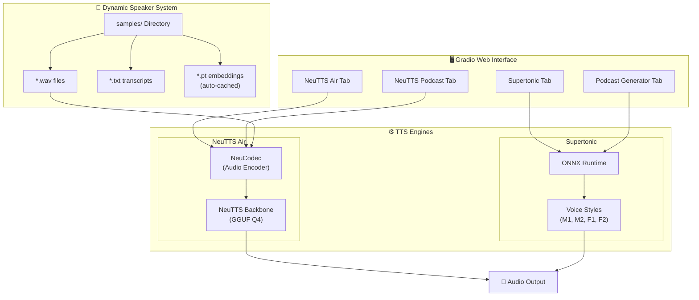

# IQ Speechy

A multi-engine text-to-speech (TTS) system with voice cloning, fast preset voices, and podcast generation.

## System Architecture



## Features

### 🎙️ NeuTTS Air (Voice Cloning)
- Clone any voice with 3-6 seconds of reference audio
- **Dynamic speaker detection** - auto-discovers voices from `samples/` folder
- Pre-cached `.pt` embeddings for faster loading
- Custom voice upload support
- **Auto-chunking** for long-form text (200 chars per chunk)

### ⚡ Supertonic (Fast TTS)
- **167x faster** than real-time
- 4 preset voices: M1, M2 (male), F1, F2 (female)
- Adjustable speed (0.9x - 1.5x) and quality steps
- Long-form text with auto-chunking
- CPU optimized (no GPU required)

### 🎙️ Podcast Generators

**Supertonic Podcast** - Fast multi-speaker:
```
[M1] Welcome to our podcast!
[F1] Thanks for having me.
[M2] Great to be here.
[F2] Let's dive in!
```

**NeuTTS Podcast** - Voice cloned with dynamic speakers:
```
[Dave] Welcome to the show!
[Jo] Thanks for having me.
[Hara] Great to be part of this!
```

## Adding New Voices

Simply drop files into `neutts-air/samples/`:

```
neutts-air/samples/
├── dave.wav          # 3-6 second audio sample
├── dave.txt          # Exact transcript of the audio
├── jo.wav
├── jo.txt
├── yourvoice.wav     # Add your own!
└── yourvoice.txt
```

✨ **On first use**, the system automatically:
1. Detects the new speaker
2. Encodes the voice embedding
3. Caches it as `yourvoice.pt` for faster future loads

## Getting Started

### 1. Clone the repository
```bash
git clone https://github.com/Hardhikman/IQ_speechy.git
cd neutts-tts-project
```

### 2. Install dependencies
```bash
python -m venv neutts-env
neutts-env\Scripts\activate  # Windows
pip install -r requirements.txt
```

### 3. Clone Supertonic repo and assets
```bash
git clone https://github.com/supertone-inc/supertonic.git supertonic
git lfs install
git clone https://huggingface.co/Supertone/supertonic assets
```

### 4. Run the application
```bash
python app.py
```

Open http://localhost:7860 in your browser.

## Project Structure

```
neutts-tts-project/
├── app.py                    # Main Gradio application (4 tabs)
├── requirements.txt          # Python dependencies
├── assets/                   # Supertonic ONNX models & voice styles
│   ├── onnx/                 # ONNX model files
│   └── voice_styles/         # M1, M2, F1, F2 style JSONs
├── neutts-air/               # NeuTTS Air library
│   ├── neuttsair/            # Core TTS module
│   └── samples/              # Voice samples (.wav, .txt, .pt)
├── supertonic/py/            # Supertonic Python inference code
└── output/                   # Generated audio files
```

## Application Tabs

| Tab | Engine | Speed | Best For |
|-----|--------|-------|----------|
| **NeuTTS Air** | NeuTTS | Slower | Custom voice cloning |
| **Supertonic** | ONNX | ⚡ 167x RT | Fast single-voice TTS |
| **🎙️ Podcast Generator** | Supertonic | ⚡ Fast | Quick 4-voice podcasts |
| **🎙️ NeuTTS Podcast** | NeuTTS | Slower | Voice-cloned multi-speaker |

## Key Technical Features

- **Dynamic Speaker Discovery**: Automatically scans `samples/` directory
- **Smart Embedding Cache**: `.pt` files auto-generated on first use
- **Cache Invalidation**: Re-encodes if `.wav` is newer than `.pt`
- **Auto-Chunking**: Long text split into optimal chunks for synthesis
- **Case-Insensitive Tags**: `[Dave]`, `[dave]`, `[DAVE]` all work

## Dependencies

- Python 3.11+
- gradio
- onnxruntime
- scipy
- soundfile
- numpy
- torch (for NeuTTS)

## License

See individual component licenses (NeuTTS Air, Supertonic).